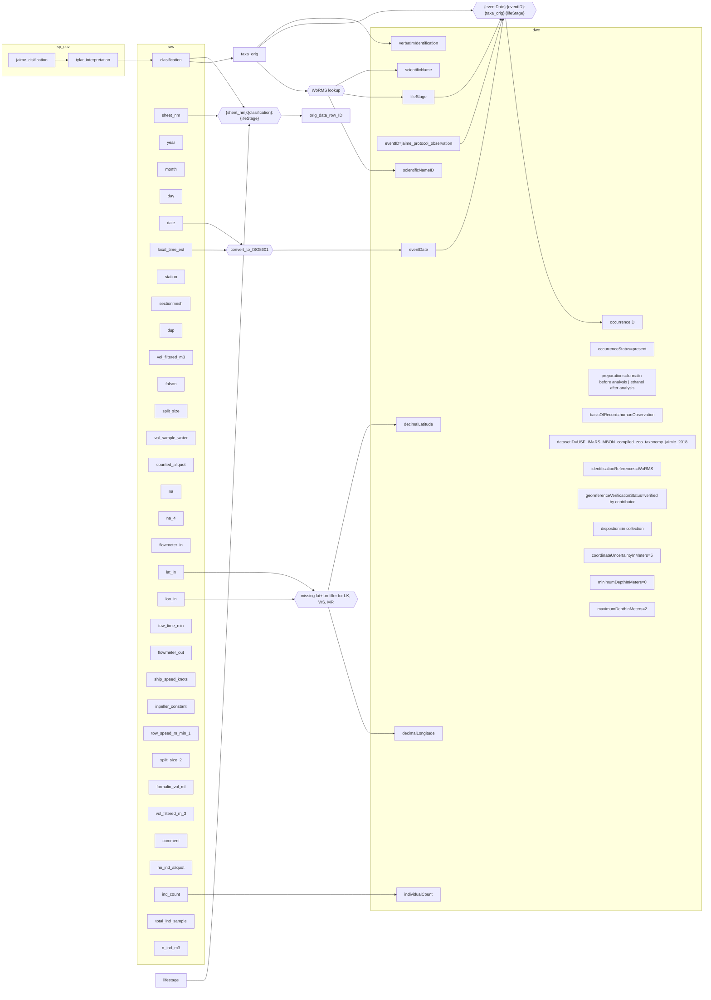

## raw-to-DwC term mapping

```mermaid
graph LR


subgraph sp_csv
    jaime_clsification --> tylar_interpretation
end

tylar_interpretation --> clasification

subgraph raw
    sheet_nm
    year
    month
    day
    date
    local_time_est
    station
    sectionmesh
    dup
    vol_filtered_m3
    folson
    split_size
    vol_sample_water
    counted_aliquot
    na 
    na_4
    flowmeter_in
    lat_in
    lon_in
    tow_time_min
    flowmeter_out
    ship_speed_knots
    inpeller_constant
    tow_speed_m_min_1
    split_size_2
    formalin_vol_ml
    vol_filtered_m_3
    comment
    clasification
    no_ind_aliquot
    ind_count
    total_ind_sample
    n_ind_m3
end

%% easy direct mappings
ind_count --> individualCount
taxa_orig --> verbatimIdentification

%% datetime
conv{{convert_to_ISO8601}}
date --> conv
local_time_est --> conv
conv --> eventDate

%% derived rowID 
row_id_gen{{"{sheet_nm}:{clasification}:{lifeStage}"}}
sheet_nm --> row_id_gen
clasification --> row_id_gen
lifestage --> row_id_gen
row_id_gen --> rowID[orig_data_row_ID]

%% intermediate columns
clasification --> taxa_orig

%% occurrenceID
occur_id_gen{{"{eventDate}:{eventID}:{taxa_orig}:{lifeStage}"}}
eventDate --> occur_id_gen
eventID --> occur_id_gen
taxa_orig --> occur_id_gen
lifeStage --> occur_id_gen
occur_id_gen --> occurrenceID

%% fix for some missing lat + Lon
loc_fix{{"missing lat+lon filler for LK, WS, MR"}}
lat_in --> loc_fix
lon_in --> loc_fix
loc_fix --> decimalLatitude
loc_fix --> decimalLongitude

%% WoRMS
taxa_orig --> WoRMS{{WoRMS lookup}}
WoRMS --> scientificName
WoRMS --> lifeStage
WoRMS --> scientificNameID

subgraph dwc
    occurrenceID
    eventDate
    decimalLatitude
    decimalLongitude
    scientificName
    individualCount
    lifeStage
    eventID[eventID=jaime_protocol_observation]
    occurrenceStatus[occurrenceStatus=present]
    preparations["preparations=formalin before analysis | ethanol after analysis"]
    scientificNameID
    basisOfRecord["basisOfRecord=humanObservation"]
    datasetID["datasetID=USF_IMaRS_MBON_compiled_zoo_taxonomy_jaimie_2018"]
    identificationReferences["identificationReferences=WoRMS"]
    verbatimIdentification
    georeferenceVerificationStatus["georeferenceVerificationStatus=verified by contributor"]
    dispostion["dispostion=in collection"]
    coordinateUncertaintyInMeters[coordinateUncertaintyInMeters=5]
    minimumDepthInMeters[minimumDepthInMeters=0]
    maximumDepthInMeters[maximumDepthInMeters=2]
end
```
